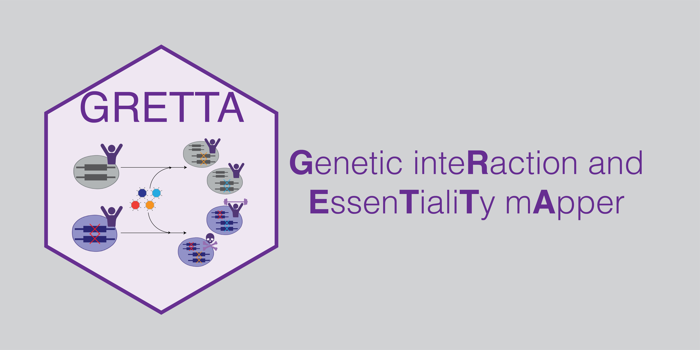
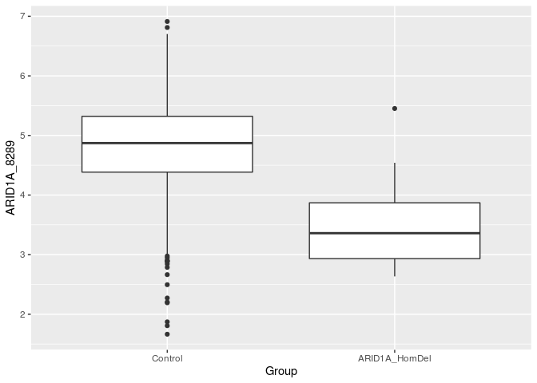
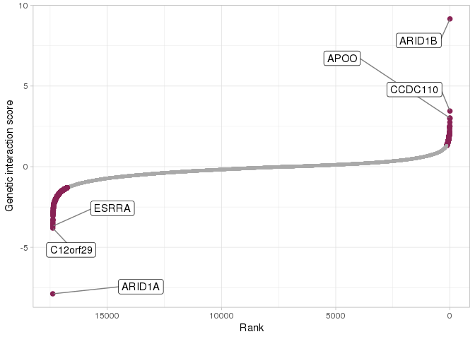
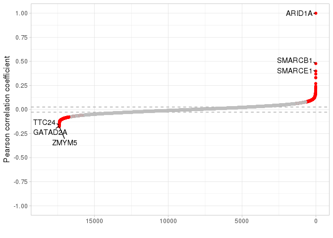

<!-- README.md is generated from README.Rmd. Please edit that file -->
<!--You'll still need to render `README.Rmd` regularly, to keep `README.md` up-to-date. `devtools::build_readme()` is handy for this. You could also use GitHub Actions to re-render `README.Rmd` every time you push. An example workflow can be found here: <https://github.com/r-lib/actions/tree/master/examples>. -->
<!-- badges: start -->

[](https://www.gnu.org/licenses/gpl-3.0)
[](https://lifecycle.r-lib.org/articles/stages.html#stable)
[](https://zenodo.org/badge/latestdoi/374398121)
<!-- badges: end -->



# Introduction

Genetic inteRaction and EssenTiality mApper (GRETTA) is an R package
that leverages data generated by the [Cancer Dependency Map (DepMap)
project](https://depmap.org/portal/) to perform in-silico genetic
knockout screens and map essentiality networks. A manuscript describing
this tool in detail in currently available as a pre-print on [bioRxiv
(Takemon, Y. and Marra, MA.,
2022)](https://doi.org/10.1101/2022.09.21.508787).

The DepMap data used in this tutorial is version 22Q2. This version
along with all versions provided in this repository were downloaded
through the DepMap data portal, which was distributed and used under the
terms and conditions of [CC Attribution 4.0
license](https://creativecommons.org/licenses/by/4.0/).

## Maintainer

This repository is maintained by [Yuka
Takemon](https://github.com/ytakemon), a PhD candidate in [Dr. Marco
Marra](https://www.bcgsc.ca/labs/marra-lab)’s laboratory at [Canada’s
Michael Smith Genome Sciences Centre](https://www.bcgsc.ca/).

### Citations

A please find the citation using `citation("GRETTA")` and include the
DOI at the top of this page. A manuscript describing GRETTA and its
usage is now available on [BioRxiv (Takemon, Y. and Marra, MA.,
2022)](https://doi.org/10.1101/2022.09.21.508787).

## Questions

Please check the [FAQ
section](https://github.com/ytakemon/GRETTA/wiki/Frequently-Asked-Questions)
for additional information and if you cannot find your answer there or
have a request please submit an
[issue](https://github.com/ytakemon/GRETTA/issues).

# Installation

You can install the GRETTA package from [GitHub](https://github.com)
with:

``` r
install.packages(c("devtools", "dplyr","forcats","ggplot2"))
devtools::install_github("ytakemon/GRETTA")
```

DepMap 22Q2 data and the data documentation files are provided above and
can be extracted directly in terminal using the following bash code (not
in R/RStudio). For other DepMap data versions please refer to the [FAQ
section](https://github.com/ytakemon/GRETTA/wiki/Frequently-Asked-Questions#q-how-to-download-and-use-other-versions-of-depmap-data).

``` bash
# Make a new directory/folder called GRETTA_project and go into directory
mkdir GRETTA_project
cd GRETTA_project

# Download data and data documentation from the web
wget https://github.com/ytakemon/GRETTA/raw/main/DepMap_data_versions/22Q1/GRETTA_DepMap_22Q2_data.tar.gz
wget https://github.com/ytakemon/GRETTA/raw/main/DepMap_data_versions/22Q1/GRETTA_DepMap_22Q2_data_document.tar.gz

# Extract data and data documentation
tar -zxvf GRETTA_DepMap_22Q2_data.tar.gz
tar -zxvf GRETTA_DepMap_22Q2_data_document.tar.gz
```

A singularity container has also been provided and instructions can be
found
[here](https://github.com/ytakemon/GRETTA/wiki/Frequently-Asked-Questions#q-how-to-run-singularity).

# Workflows

## Genetic interaction mapping

1.  Install `GRETTA` and download accompanying data.
2.  Select mutant cell lines that carry mutations in the gene of
    interest and control cell lines.
    -   ([optional
        specifications](https://github.com/ytakemon/GRETTA/wiki/Frequently-Asked-Questions#q-how-can-context-specific-genetic-screens-or-essentiality-network-analyses-be-performed))
        can be used to select cell lines based on disease type, disease
        subtype, or amino acid change.
3.  Determine differential expression between mutant and control cell
    line groups.
    -   (optional but recommended).
4.  Perform *in silico* genetic screen.
5.  Visualize results.

## Co-essential network mapping

1.  Install `GRETTA` and download accompanying data.
2.  Run correlation coefficient analysis.
    -   ([optional
        specifications](https://github.com/ytakemon/GRETTA/wiki/Frequently-Asked-Questions#q-how-can-context-specific-genetic-screens-or-essentiality-network-analyses-be-performed:~:text=For%20the%20essentiality%20network%20analysis%2C%20context%2Dspecific%20cell%20lines%20can%20be%20selected%20in%20two%20ways%3A))
        can be used to perform analysis on cell lines of a specific
        disease type(s).
3.  Calculate inflection points of negative/positive curve to determine
    a threshold.
4.  Apply threshold.
5.  Visualize results.

# Example: Identifying *ARID1A* genetic interactions

*ARID1A* encodes a member of the chromatin remodeling SWItch/Sucrose
Non-Fermentable (SWI/SNF) complex and is a frequently mutated gene in
cancer. It is known that *ARID1A* and its homolog, *ARID1B*, are
synthetic lethal to one another: The dual loss of ARID1A and its
homolog, ARID1B, in a cell is lethal; however, the loss of either gene
alone is not ([Helming et al., 2014](https://doi.org/10.1038/nm.3480)).
This example will demonstrate how we can identify synthetic lethal
interactors of *ARID1A* using `GRETTA` and predict this known
interaction.

For this example you will need to call the following libraries

``` r
library(dplyr)
library(forcats)
library(ggplot2)
library(GRETTA)
```

Then, assign variable that point to where the `.rda` files are stored
and where result files should go.

``` r
gretta_data_dir <- "/path/to/GRETTA_project/data/"
gretta_output_dir <- "/path/to/results/folder/"
```

## Exploring cell lines

One way to explore cell lines that are available in DepMap is through
their [portal](https://depmap.org/portal/). However, there are some
simple built-in methods in GRETTA to provide users with a way to glimpse
the data using the series of `list_available` functions:
`list_available_mutations()`, `list_available_cancer_types()`,
`list_available_cancer_subtypes()`

Current DepMap data used by default is version 22Q2, which contains
whole-genome sequencing or whole-exome sequencing annotations for `1771`
cancer cell lines (`1406` cell lines with RNA-seq data, `375` cell lines
with quantitative proteomics data, and `1086` cell lines with
CRISPR-Cas9 knockout screen data)

``` r
## Find ARID1A hotspot mutations detected in all cell lines
list_available_mutations(gene = "ARID1A", is_hotspot = TRUE, data_dir = gretta_data_dir) 
```

``` r
## List all available cancer types
list_available_cancer_types(data_dir = gretta_data_dir)
#>  [1] "Kidney Cancer"              "Leukemia"                  
#>  [3] "Lung Cancer"                "Non-Cancerous"             
#>  [5] "Sarcoma"                    "Lymphoma"                  
#>  [7] "Colon/Colorectal Cancer"    "Pancreatic Cancer"         
#>  [9] "Gastric Cancer"             "Rhabdoid"                  
#> [11] "Endometrial/Uterine Cancer" "Esophageal Cancer"         
#> [13] "Breast Cancer"              "Brain Cancer"              
#> [15] "Ovarian Cancer"             "Bone Cancer"               
#> [17] "Myeloma"                    "Head and Neck Cancer"      
#> [19] "Bladder Cancer"             "Skin Cancer"               
#> [21] "Bile Duct Cancer"           "Prostate Cancer"           
#> [23] "Cervical Cancer"            "Thyroid Cancer"            
#> [25] "Neuroblastoma"              "Eye Cancer"                
#> [27] "Liposarcoma"                "Gallbladder Cancer"        
#> [29] "Teratoma"                   "Unknown"                   
#> [31] "Liver Cancer"               "Adrenal Cancer"            
#> [33] "Embryonal Cancer"

## List all available cancer subtypes
list_available_cancer_subtypes(input_disease = "Lung Cancer", data_dir = gretta_data_dir)
#>  [1] "Non-Small Cell Lung Cancer (NSCLC), Adenocarcinoma"          
#>  [2] "Small Cell Lung Cancer (SCLC)"                               
#>  [3] "Non-Small Cell Lung Cancer (NSCLC), Squamous Cell Carcinoma" 
#>  [4] "Mesothelioma"                                                
#>  [5] "Non-Small Cell Lung Cancer (NSCLC), Large Cell Carcinoma"    
#>  [6] NA                                                            
#>  [7] "Non-Small Cell Lung Cancer (NSCLC), unspecified"             
#>  [8] "Non-Small Cell Lung Cancer (NSCLC), Adenosquamous Carcinoma" 
#>  [9] "Carcinoid"                                                   
#> [10] "Non-Small Cell Lung Cancer (NSCLC), Mucoepidermoid Carcinoma"
#> [11] "Carcinoma"
```

## Selecting mutant and control cell line groups

As default `select_cell_lines()` will identify cancer cell lines with
loss-of-function alterations in the gene specified and group them into
six different groups.

Loss-of-function alterations include variants that are annotated as:
`"Nonsense_Mutation", "Frame_Shift_Ins", "Splice_Site", "De_novo_Start_OutOfFrame", "Frame_Shift_Del", "Start_Codon_SNP", "Start_Codon_Del",`
and `"Start_Codon_Ins"`. Copy number alterations are also taken into
consideration and group as `"Deep_del", "Loss", "Neutral",` or
`"Amplified"`.

The cell line groups assigned by default are:

-   `Control` cell lines do not harbor any single nucleotide variations
    (SNVs) or insertions and deletions (InDels) with a neutral copy
    number (CN).
-   `HomDel` cell lines harbor one or more homozygous deleterious SNVs
    or have deep CN loss.
-   `T-HetDel` cell lines harbor two or more heterozygous deleterious
    SNVs/InDels with neutral or CN loss.
-   `HetDel` cell lines harbor one heterozygous deleterious SNV/InDel
    with neutral CN, or no SNV/InDel with CN loss.
-   `Amplified` cell lines harbor no SNVs/InDels with increased CN.
-   `Others` cell lines harbor deleterious SNVs with increased CN.

``` r
ARID1A_groups <- select_cell_lines(input_gene = "ARID1A", data_dir = gretta_data_dir)
#> Selecting mutant groups for: ARID1A in all cancer cell lines

## Show number of cell lines in each group 
count(ARID1A_groups, Group)
#> # A tibble: 5 × 2
#>   Group               n
#>   <chr>           <int>
#> 1 ARID1A_HetDel      61
#> 2 ARID1A_HomDel      23
#> 3 ARID1A_T-HetDel    30
#> 4 Control           906
#> 5 Others             66
```

### Optional filter for specific cancer types

``` r
## Find pancreatic cancer cell lines with ARID1A mutations
ARID1A_pancr_groups <- select_cell_lines(input_gene = "ARID1A", 
                                         input_disease = "Pancreatic Cancer",
                                         data_dir = gretta_data_dir)
#> Selecting mutant groups for: ARID1A in Pancreatic Cancer,  cell lines

## Show number of cell lines in each group 
count(ARID1A_pancr_groups, Group)
#> # A tibble: 4 × 2
#>   Group             n
#>   <chr>         <int>
#> 1 ARID1A_HetDel     5
#> 2 ARID1A_HomDel     4
#> 3 Control          36
#> 4 Others            2
```

## Check for differential expression

Of the three mutant cancer cell line groups `ARID1A_HomDel`,
`ARID1A_T-HetDel`, and `ARID1A_HetDel`, cancer cell lines with
`ARID1A_HomDel` mutations are most likely to result in a loss or reduced
expression of *ARID1A*. Therefore, we want to check whether cell lines
in `ARID1A_HomDel` mutant group have significantly less *ARID1A* RNA or
protein expression compared to control cell lines.

``` r
## Select only HomDel and Control cell lines
ARID1A_groups_subset <- ARID1A_groups %>% filter(Group %in% c("ARID1A_HomDel", "Control"))

## Get RNA expression 
ARID1A_rna_expr <- extract_rna_expr(
  input_samples = ARID1A_groups_subset$DepMap_ID, 
  input_genes = "ARID1A",
  data_dir = gretta_data_dir)
#> [1] "Following sample did not contain profile data: ACH-000047, ACH-000426, ACH-000658, ACH-000979, ACH-001039, ACH-001063, ACH-001065, ACH-001107, ACH-001126, ACH-001137, ACH-001205, ACH-001212, ACH-001227, ACH-001331, ACH-001544, ACH-001606, ACH-001639, ACH-001675, ACH-001955, ACH-001956, ACH-001957, ACH-002083, ACH-002106, ACH-002109, ACH-002110, ACH-002114, ACH-002116, ACH-002119, ACH-002140, ACH-002141, ACH-002143, ACH-002150, ACH-002156, ACH-002160, ACH-002161, ACH-002179, ACH-002181, ACH-002186, ACH-002189, ACH-002198, ACH-002202, ACH-002210, ACH-002212, ACH-002217, ACH-002228, ACH-002229, ACH-002230, ACH-002233, ACH-002234, ACH-002239, ACH-002243, ACH-002247, ACH-002249, ACH-002250, ACH-002257, ACH-002261, ACH-002263, ACH-002265, ACH-002269, ACH-002278, ACH-002280, ACH-002282, ACH-002283, ACH-002284, ACH-002285, ACH-002294, ACH-002295, ACH-002296, ACH-002297, ACH-002298, ACH-002304, ACH-002305, ACH-002399, ACH-002874, ACH-002875"
```

Not all cell lines contain RNA and/or protein expression profiles, and
not all proteins were detected by mass spectrometer. (Details on data
generation can be found on the [DepMap
site](https://depmap.org/portal/).)

``` r
## Get protein expression
ARID1A_prot_expr <- extract_protein_expr(
  input_samples = ARID1A_groups_subset$DepMap_ID,
  input_genes = "ARID1A",
  data_dir = gretta_data_dir)

## Produces an error message since ARID1A protein data is not available
```

Using Welch’s t-test, we can check to see whether *ARID1A* RNA
expression (in TPM) is significantly reduced in `ARID1A_HomDel` cell
lines compared to `Controls`.

``` r
## Append groups and test differential expression
ARID1A_rna_expr <- left_join(
  ARID1A_rna_expr,
  ARID1A_groups_subset %>% select(DepMap_ID, Group)) %>%
  mutate(Group = fct_relevel(Group,"Control")) # show Control group first
#> Joining with `by = join_by(DepMap_ID)`

## T-test 
t.test(ARID1A_8289 ~ Group, ARID1A_rna_expr)
#> 
#>  Welch Two Sample t-test
#> 
#> data:  ARID1A_8289 by Group
#> t = 2.5764, df = 22.873, p-value = 0.01692
#> alternative hypothesis: true difference in means between group Control and group ARID1A_HomDel is not equal to 0
#> 95 percent confidence interval:
#>  0.1146094 1.0498810
#> sample estimates:
#>       mean in group Control mean in group ARID1A_HomDel 
#>                    4.635784                    4.053539

## plot 
ggplot(ARID1A_rna_expr, aes(x = Group, y = ARID1A_8289)) +
  geom_boxplot()
```



## Perform genome-wide *in silico* genetic screen

After determining cell lines in the `ARID1A_HomDel` group has
statistically significant reduction in RNA expression compared to
`Control` cell lines, the next step is to perform a *in silico* genetic
screen using `screen_results()`. This uses the dependency probabilities
(or **“lethality probabilities”**) generated from DepMap’s genome-wide
CRISPR-Cas9 knockout screen.

**Lethality probabilities** range from 0.0 to 1.0 and is quantified for
each gene knock out in every cancer cell line screened (There are 18,334
genes targeted in 739 cancer cell lines). A gene knock out with a
lethality probability of 0.0 indicates a non-essential for the cell
line, and a gene knock out with a 1.0 indicates an essential gene (ie.
very lethal). Details can be found in [Meyers, R., et al.,
2017](https://doi.org/10.1038/ng.3984)

At its core, `screen_results()` performs multiple Mann-Whitney U tests,
comparing lethality probabilities of each targeted gene between mutant
and control groups. This generates a data frame with the following
columns:

-   `GeneName_ID` - Hugo symbol with NCBI gene ID
-   `GeneNames` - Hugo symbol
-   `_median, _mean, _sd, _iqr` - Control and mutant group’s median,
    mean, standard deviation (sd), and interquartile range (iqr) of
    dependency probabilities. Dependency probabilities range from zero
    to one, where one indicates a essential gene (ie. KO of gene was
    lethal) and zero indicates a non-essential gene (KO of gene was not
    lethal)
-   `Pval` - P-value from Mann Whitney U test between control and mutant
    groups.
-   `Adj_pval` - BH-adjusted P-value.
-   `log2FC_by_median` - Log2 normalized median fold change of
    dependency probabilities (mutant / control).
-   `log2FC_by_mean` - Log2 normalized mean fold change of dependency
    probabilities (mutant / control).
-   `CliffDelta` - Cliff’s delta non-parametric effect size between
    mutant and control dependency probabilities. Ranges between -1 to 1.
-   `dip_pval` - Hartigan’s dip test p-value. Tests whether distribution
    of mutant dependency probability is unimodel. If dip test is
    rejected (p-value \< 0.05), this indicates that there is a
    multimodel dependency probability distribution and that there may be
    another factor contributing to this separation.
-   `Interaction_score` - Combined value generated from signed p-values:
    -log10(Pval) \* sign(log2FC_by_median). Negative scores indicate
    lethal genetic interaction, and positive scores indicate alleviating
    genetic interaction.

> **Warning** This process may take a few hours depending on the number
> of cores assigned. Our example below `GI_screen()` took \~2 hours to
> process.

``` r
ARID1A_mutant_id <- ARID1A_groups %>% filter(Group %in% c("ARID1A_HomDel")) %>% pull(DepMap_ID)
ARID1A_control_id <- ARID1A_groups %>% filter(Group %in% c("Control")) %>% pull(DepMap_ID)

## See warning above.
## This can take several hours depending on number of lines/cores used. 
screen_results <- GI_screen(
  control_id = ARID1A_control_id, 
  mutant_id = ARID1A_mutant_id,
  core_num = 5, # depends on how many cores you have  
  output_dir = gretta_output_dir, # Will save your results here as well as in the variable
  data_dir = gretta_data_dir,
  test = FALSE) # use TRUE to run a short test to make sure all will run overnight.
```

We can quickly determine whether any lethal genetic interactions were
predicted by `GRETTA`. We use a `Pval` cut off of 0.05 and rank based on
the `Interaction_score`.

``` r
screen_results %>% 
  filter(Pval < 0.05) %>%
  arrange(-Interaction_score) %>% 
  select(GeneNames:Mutant_median, Pval, Interaction_score) %>% head
#> # A tibble: 6 × 5
#>   GeneNames Control_median Mutant_median     Pval Interaction_score
#>   <chr>              <dbl>         <dbl>    <dbl>             <dbl>
#> 1 ARID1B           0.0579         0.515  6.84e-10              9.16
#> 2 CCDC110          0.0165         0.0303 3.54e- 4              3.45
#> 3 APOO             0.0168         0.0283 9.61e- 4              3.02
#> 4 NHS              0.0352         0.0539 9.69e- 4              3.01
#> 5 SLC66A2          0.00793        0.0134 1.06e- 3              2.98
#> 6 ATXN7L1          0.0138         0.0259 1.78e- 3              2.75
```

We immediately see that *ARID1B*, a known synthetic lethal interaction
of *ARID1A*, was a the top of this list.

### Optional: Performing a small-scale screen

To perform a small in silico screen, a list of genes can be provided in
the `gene_list =` argument.

``` r
small_screen_results <- GI_screen(
  control_id = ARID1A_control_id, 
  mutant_id = ARID1A_mutant_id,
  gene_list = c("ARID1A", "ARID1B", "SMARCA2", "GAPDH", "SMARCC2"),
  core_num = 5, # depends on how many cores you have  
  output_dir = gretta_output_dir, # Will save your results here as well as in the variable
  data_dir = gretta_data_dir) 
```

## Visualize screen results

Finally once the *in silico* screen is complete, results can be quickly
visualized using `plot_screen()`. Positive genetic interaction scores
indicate potential synthetic lethal genetic interactors, and negative
scores indicate potential alleviating genetic interactors. As expected,
we identified *ARID1B* as a synthetic lethal interactor of *ARID1A*.

``` r
## Visualize results, turn on gene labels, 
## and label three genes each that are predicted to have 
## lethal and alleviating genetic interactions, respectively

plot_screen(result_df = screen_results, 
            label_genes = TRUE, 
            label_n = 3)
#> Warning: Removed 7 rows containing missing values (`geom_point()`).
```



# Example: Identifying *ARID1A* co-essential genes

Perturbing genes that function in same/synergistic pathways or in the
same complex are said to show similar fitness effects, and these that
show effects are considered to be “co-essential”. The strategy of
mapping co-essential gene have been used by several studies to attribute
functions to previously annotated genes as well as to identify a novel
subunit of a large complex ([Wainberg et
al. 2021](https://doi.org/10.1038/s41588-021-00840-z); [Pan et
al. 2018](https://doi.org/10.1016/j.cels.2018.04.011)).

Given that ARID1A is known subunit of the mammalian SWI/SNF complex
([Mashtalir et al. 2018](https://doi.org/10.1016/j.cell.2018.09.032)),
we expect that members of the SWI/SNF complex would share
co-essentiality with *ARID1A*. This example will demonstrate how we can
map *ARID1A*’s co-essential gene network using `GRETTA`.

## Identifying genes with highest correlation coefficients

To determine co-essential genes, we will perform multiple Pearson
correlation coefficient analyses between *ARID1A* KO effects and the KO
effects of all 18,333 genes. A cut off will be determined by calculating
the inflection point of the ranked coefficient curve. As expected find
SWI/SNF subunit encoding genes, *SMARCE1* and *SMARCB1*, as the top two
co-essential genes.

> **Warning** This process may take several minutes. Our example below
> `coessential_map()` + `get_inflection_points()` took \~17 minutes to
> process.

``` r
## Map co-essential genes
coess_df <- coessential_map(
  input_gene = "ARID1A", 
  data_dir = gretta_data_dir, 
  output_dir = gretta_output_dir) 

## Calculate inflection points of positive and negative curve using co-essential gene results.
coess_inflection_df <- get_inflection_points(coess_df)
```

Next, we annotate the data frame containing the co-essential network
data and visualize.

``` r
## Combine and annotate data frame containing co-essential genes
coess_annotated_df <- annotate_coessential_df(coess_df, coess_inflection_df)

plot_coessential_genes(
  result_df = coess_annotated_df, 
  inflection_df = coess_inflection_df,
  label_genes = TRUE, # Should gene names be labeled?
  label_n = 3) # Number of genes to display from each end
```



We also see that the top ten *ARID1A* co-essential genes include eight
known SWI/SNF subunits, namely *ARID1A*, *SMARCB1*, *SMARCE1*,
*SMARCC1*, *SS18*, *DPF2*, *SMARCC2*, and *SMARCD2*.

``` r
## Show top 10 co-essential genes. 
coess_annotated_df %>% arrange(Rank) %>% head(10)
#> # A tibble: 10 × 9
#>    GeneNameID_A GeneNameID_B estimate statistic  p.value parameter  Rank
#>    <chr>        <chr>           <dbl>     <dbl>    <dbl>     <dbl> <int>
#>  1 ARID1A_8289  ARID1A_8289     1        Inf    0             1086     1
#>  2 ARID1A_8289  SMARCB1_6598    0.477     17.9  7.45e-59      1086     2
#>  3 ARID1A_8289  SMARCE1_6605    0.399     14.3  4.30e-39      1086     3
#>  4 ARID1A_8289  SMARCC1_6599    0.369     13.1  9.35e-33      1086     4
#>  5 ARID1A_8289  SS18_6760       0.332     11.6  4.85e-26      1086     5
#>  6 ARID1A_8289  DPF2_5977       0.330     11.5  1.15e-25      1086     6
#>  7 ARID1A_8289  SMARCD2_6603    0.270      9.22 1.10e-16      1086     7
#>  8 ARID1A_8289  SMARCC2_6601    0.242      8.22 2.34e-13      1086     8
#>  9 ARID1A_8289  BCL2_596        0.231      7.82 4.05e-12      1086     9
#> 10 ARID1A_8289  CBFB_865        0.224      7.58 2.07e-11      1086    10
#> # ℹ 2 more variables: Padj_BH <dbl>, Candidate_gene <lgl>
```

### Optional filter for specific cancer types

Instead of mapping for essentiality across all available cell lines,
users can also subset by disease type using the option
`input_disease = ""`, or within a pre-selected group of cell lines using
the option `input_cell_lines = c()`. Below we provide an example of how
ARID1A essential genes are mapped for pancreatic cancers. **Note:**
depending on the number of cell lines that are available after the
subsetting step, the inflection point calculation and thresholds may not
be optimal.

``` r
## Map co-essential genes in pancreatic cancers only
coess_df <- coessential_map(
  input_gene = "ARID1A",
  input_disease = "Pancreatic Cancer",
  core_num = 5, ## Depending on how many cores you have access to, increase this value to shorten processing time.
  data_dir = gretta_data_dir, 
  output_dir = gretta_output_dir,
  test = FALSE)
```

# Session information

``` r
sessionInfo()
#> R version 4.2.2 (2022-10-31)
#> Platform: x86_64-pc-linux-gnu (64-bit)
#> Running under: CentOS Linux 7 (Core)
#> 
#> Matrix products: default
#> BLAS:   /gsc/software/linux-x86_64-centos7/R-4.2.2/lib64/R/lib/libRblas.so
#> LAPACK: /gsc/software/linux-x86_64-centos7/R-4.2.2/lib64/R/lib/libRlapack.so
#> 
#> locale:
#>  [1] LC_CTYPE=en_US.UTF-8       LC_NUMERIC=C              
#>  [3] LC_TIME=en_US.UTF-8        LC_COLLATE=en_US.UTF-8    
#>  [5] LC_MONETARY=en_US.UTF-8    LC_MESSAGES=en_US.UTF-8   
#>  [7] LC_PAPER=en_US.UTF-8       LC_NAME=C                 
#>  [9] LC_ADDRESS=C               LC_TELEPHONE=C            
#> [11] LC_MEASUREMENT=en_US.UTF-8 LC_IDENTIFICATION=C       
#> 
#> attached base packages:
#> [1] stats     graphics  grDevices utils     datasets  methods   base     
#> 
#> other attached packages:
#>  [1] GRETTA_0.6.0    forcats_1.0.0   stringr_1.5.0   dplyr_1.1.1    
#>  [5] purrr_1.0.1     readr_2.1.4     tidyr_1.3.0     tibble_3.2.1   
#>  [9] ggplot2_3.4.1   tidyverse_1.3.2
#> 
#> loaded via a namespace (and not attached):
#>  [1] matrixStats_0.63.0            fs_1.5.2                     
#>  [3] doMC_1.3.8                    lubridate_1.9.0              
#>  [5] doParallel_1.0.17             httr_1.4.5                   
#>  [7] tools_4.2.2                   backports_1.4.1              
#>  [9] utf8_1.2.3                    R6_2.5.1                     
#> [11] nortest_1.0-4                 DBI_1.1.3                    
#> [13] colorspace_2.1-0              withr_2.5.0                  
#> [15] tidyselect_1.2.0              Exact_3.2                    
#> [17] compiler_4.2.2                rcompanion_2.4.21            
#> [19] cli_3.6.1                     rvest_1.0.3                  
#> [21] expm_0.999-7                  xml2_1.3.3                   
#> [23] sandwich_3.0-2                labeling_0.4.2               
#> [25] inflection_1.3.6              diptest_0.76-0               
#> [27] scales_1.2.1                  lmtest_0.9-40                
#> [29] mvtnorm_1.1-3                 proxy_0.4-27                 
#> [31] multcompView_0.1-8            RootsExtremaInflections_1.2.1
#> [33] digest_0.6.30                 rmarkdown_2.18               
#> [35] pkgconfig_2.0.3               htmltools_0.5.3              
#> [37] highr_0.9                     dbplyr_2.2.1                 
#> [39] fastmap_1.1.0                 rlang_1.1.0                  
#> [41] readxl_1.4.2                  rstudioapi_0.14              
#> [43] farver_2.1.1                  generics_0.1.3               
#> [45] zoo_1.8-11                    jsonlite_1.8.4               
#> [47] googlesheets4_1.0.1           magrittr_2.0.3               
#> [49] modeltools_0.2-23             Matrix_1.5-1                 
#> [51] Rcpp_1.0.10                   DescTools_0.99.48            
#> [53] munsell_0.5.0                 fansi_1.0.4                  
#> [55] lifecycle_1.0.3               multcomp_1.4-23              
#> [57] stringi_1.7.12                yaml_2.3.6                   
#> [59] MASS_7.3-58.1                 rootSolve_1.8.2.3            
#> [61] plyr_1.8.8                    grid_4.2.2                   
#> [63] parallel_4.2.2                ggrepel_0.9.3                
#> [65] crayon_1.5.2                  lmom_2.9                     
#> [67] lattice_0.20-45               haven_2.5.1                  
#> [69] splines_4.2.2                 hms_1.1.3                    
#> [71] knitr_1.41                    pillar_1.9.0                 
#> [73] boot_1.3-28                   gld_2.6.6                    
#> [75] stats4_4.2.2                  codetools_0.2-18             
#> [77] reprex_2.0.2                  glue_1.6.2                   
#> [79] evaluate_0.18                 data.table_1.14.8            
#> [81] modelr_0.1.10                 vctrs_0.6.1                  
#> [83] tzdb_0.3.0                    foreach_1.5.2                
#> [85] cellranger_1.1.0              gtable_0.3.3                 
#> [87] assertthat_0.2.1              xfun_0.35                    
#> [89] coin_1.4-2                    libcoin_1.0-9                
#> [91] broom_1.0.4                   e1071_1.7-13                 
#> [93] class_7.3-20                  survival_3.4-0               
#> [95] googledrive_2.0.0             gargle_1.2.1                 
#> [97] iterators_1.0.14              timechange_0.1.1             
#> [99] TH.data_1.1-1
```
